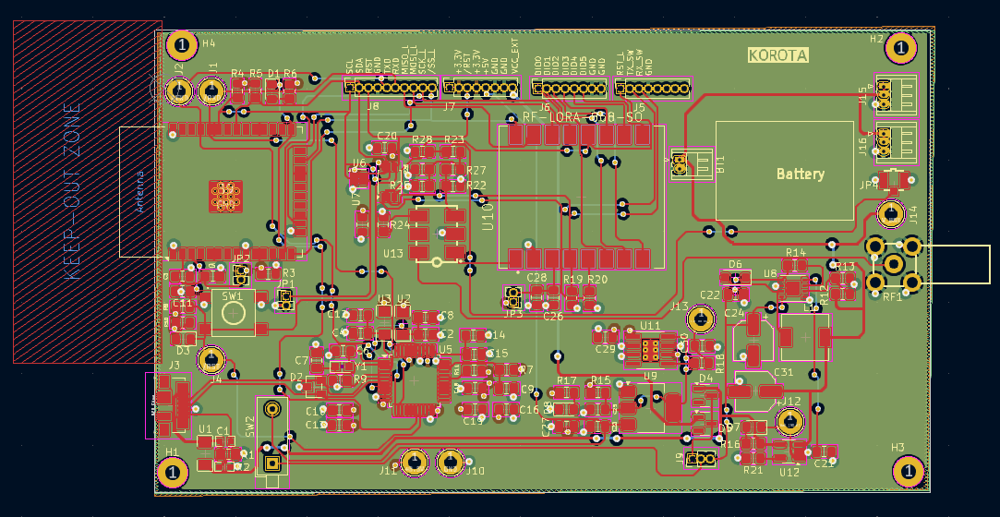
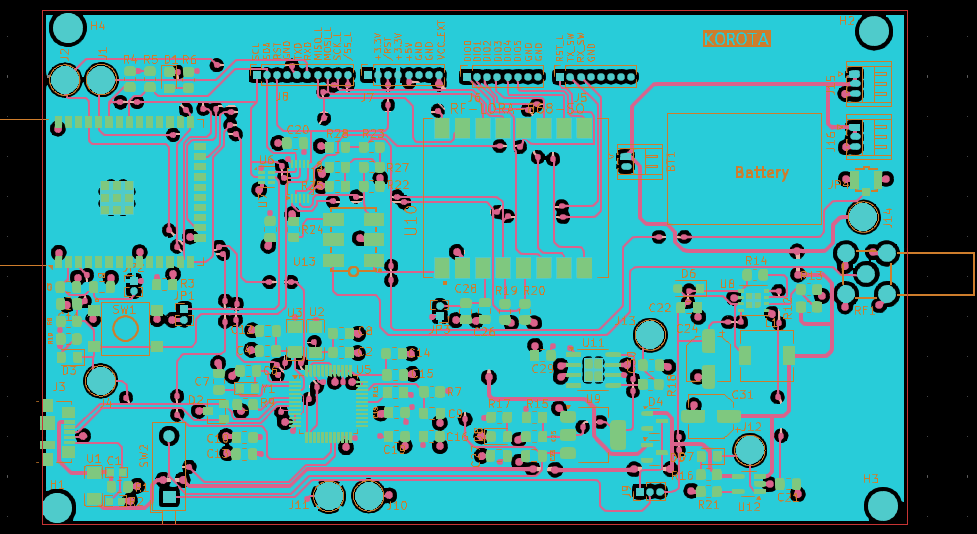

# TSL25711 sensor with LoRa module and ESP32 chip 

## Bloc Diagramm

Le module est un End Device LoRa. C'est un dispositif IoT permettant de mesurer le niveau de luminosité grace au capteur TSL2571 et transmettre ces données à un serveur LoRaWAN (NetWork Serveur + Application Serveur) . Il peut recevoir des informations de commandes downlink de l'utilisateur.

- RF-LORA-868-SO : Transceiver LoRa pour la transmission et la reception de données sans fils. Il communique avec le MCU via une interface SPI. MISO_L pour l'envoie de données du transceiver vers le MCU et MOSI_L pour l'envoie des données du MCU vers le transceiver.
- TSL25711 : Dispositif sensible à la lumière ambiante. La valeur de sortie du capteur est transférée au MCU via l'interface I2C. Le MCU determine la valeur en LUX du rayonnement lumineux grace à une formule empirique. On retrouve le capteur dans les écrans de pc ou des smartphones. L'objectif est afin d’adapter l’intensité lumineuse émise par l’écran à la lumière ambiante, l’objectif étant de réduire la consommation de l’écran qui peut représenter jusqu’à 40% de l’énergie consommée.  
- MCU est un ESP32 
- Le dispositif possède 3 modes d'alimentations : USB, battery, ou par une alimentation externe. Lorsque le module est alimentée par USB, la batterie est chargée par la même occasion via le circuit MCP73831. 
- Il existe plusieurs points de tests permettant de visualiser grâce un oscilloscope les trames LoRa, la consommation de la carte etc...
- Le End Device est utilisé pour adapter l'éclairement d'un laboratoire en fonction de la lumière ambiante. 

- Le firmware est dévéloppé avec ESP-IDF. 

## PCB

<!--  -->

